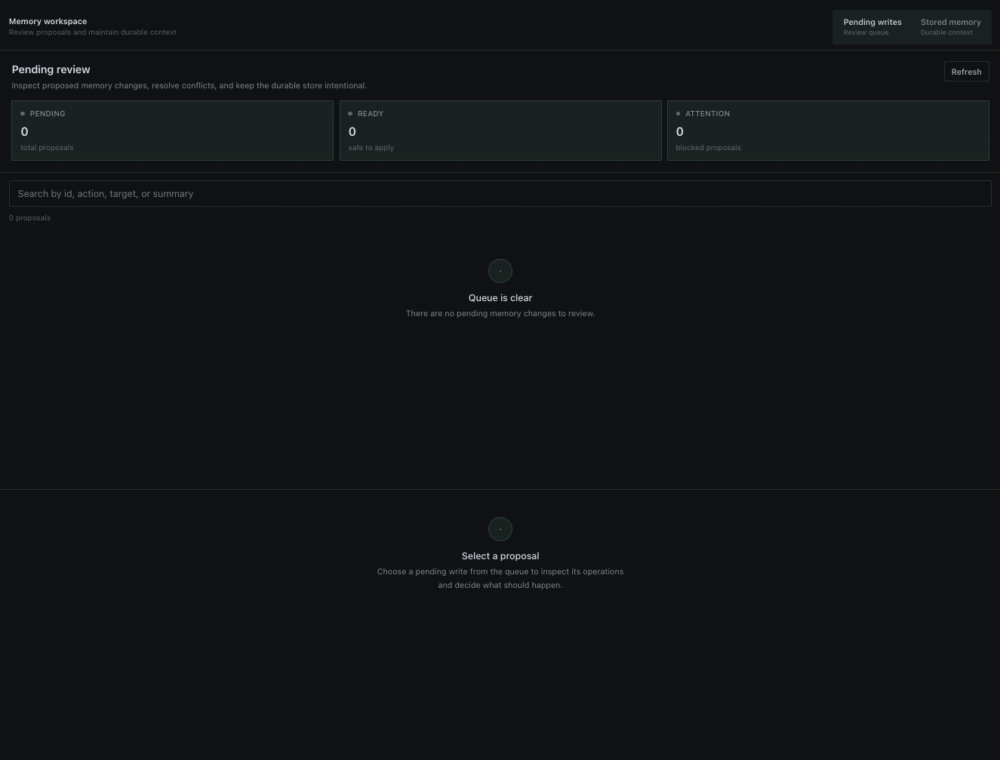

# Magi

Magi is a Hermes plugin for reviewing pending memory writes and managing the built-in `MEMORY.md` and `USER.md` stores in Hermes Desktop. Requires Hermes `>=0.21.5`.


## Install

```bash
hermes plugins install https://github.com/MarcosAlves90/magi
hermes plugins enable magi
```

In Hermes Desktop, go to **Capabilities → Plugins** and enable both the **Agent** plugin for your active profile and the **Desktop Magi** plugin. These switches are independent. If Desktop was already open, choose **Rescan** first. Then open **Magi** from the sidebar.

## Use Magi in Desktop



- **Pending writes:** Review each proposal using **Overview**, **Proposal**, **Diff**, **Raw**, or **Verify**, then approve or reject it. Bulk actions require confirmation. Proposals targeting entries that no longer exist are marked obsolete and can be removed with **Delete obsolete**.
- **Stored memory:** Switch between **Memory** (`MEMORY.md`) and **User** (`USER.md`). Search entries, inspect usage and remaining capacity, and add or edit entries. Deletion requires confirmation.
- **Resizable views:** Drag the lower edge of the pending-write inspector or stored-memory editor to change its height.
- **AI compaction:** Select a store and choose **Compact with AI** to review a proposed shorter version. Magi accepts a preview only if it uses at most 60% of the original characters (at least a 40% reduction); it can retry up to three times. If no safe reduction is available, the memory stays unchanged. Nothing is written until you choose **Apply compaction**. If the source changes after preview, the apply is rejected.

Pending-write decisions and compaction previews work without an open chat session. Stored-memory changes use Hermes' native memory safeguards, including checks against stale data. Applying AI compaction additionally requires the native conditional-batch API (`MemoryStore.apply_batch(expected_entries=...)`, proposed in [Hermes PR #135901](https://github.com/NousResearch/hermes-agent/pull/135901)). Older Hermes versions refuse Apply without modifying memory; pending review and manual stored-memory edits remain available.

## Configuration

Set these options in the Magi plugin settings:

| Option | Default | Purpose |
| --- | --- | --- |
| `compaction_model` | Empty | Model for AI compaction; empty uses the active/default Hermes model. |
| `home_override` | Empty | Optional custom Hermes home directory; empty uses the active profile. |
| `default_page_size` | `20` | Default number of pending writes listed. |
| `max_page_size` | `100` | Maximum number of list/search results. |

Choosing a specific `compaction_model` requires operator consent to Magi's declared `llm.model_override` capability (or the equivalent explicit Hermes permission `plugins.entries.magi.llm.allow_model_override`). Hermes also enforces any configured `allowed_models` restriction.

## Commands

In a Hermes session:

```text
/magi list [page] [limit]
/magi show <id|prefix|oldest|newest>
/magi diff <id|prefix|oldest|newest>
/magi raw <id|prefix|oldest|newest>
/magi find <text>
/magi stats
/magi verify [id|all]
/magi path <id|prefix>
/memory-show <id|prefix>
/memory-compact-preview <memory|user>
```

From the terminal:

```bash
hermes magi list
hermes magi show newest
hermes magi diff <id> | less
hermes magi raw <id> | less
hermes magi verify all
```

Use the terminal for large records that may exceed chat message limits.

## Security and privacy

- **Local reads:** Magi reads the active profile's pending-memory records and Hermes' `MEMORY.md` / `USER.md` stores. `home_override` can redirect these reads to a home directory you select.
- **Changes:** Approval, rejection, entry edits and compaction require explicit user actions. Writes go through Hermes' native memory APIs; Magi does not edit the stores directly.
- **AI access:** Compaction sends the selected memory content through Hermes' `ctx.llm` interface to the configured model/provider. Hermes owns provider credentials; Magi does not read or store them.
- **Other activity:** Magi makes no direct third-party network calls, launches no shell commands or subprocesses, runs no long-lived background jobs, and collects no telemetry or usage data. While its Desktop page is open, it polls the local plugin backend every five seconds.

## Development

Run the repository verification suite:

```bash
./verify.sh
```

This checks Python syntax, runs tests with more than 95% line coverage, and validates the plugin with Hermes' `plugins validate --install-deps` admission check. Compaction apply requires Hermes' public conditional `MemoryStore.apply_batch(expected_entries=...)` interface. The minimum supported Hermes version for other Magi operations remains `>=0.21.5`; on older versions without the conditional API, compaction Apply is disabled to preserve stale-preview safety.
